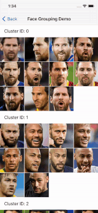

# LookKit SDK

LookKit is a very light weight package aim to make using Computer Vision simple as possible.
Inspired by Dlib and Deepface frameworks syntex. It is a hybrid package wrapping state-of-the-art models: VGG-Face2, Google FaceNet and Apple Vision.
LookKit contain no external dependency and was written in 100% pure Swift.

It use 2 main concepts:
1. Image Analyzing Pipeline.
2. Process mulitple pipelines over batch of photos.

It has 3 main API's:
1. ```Recognition``` - For face recognition/grouping.
2. ```Detector``` - For using many available image detection operations.
3.  ```ImageProcessor``` - For Image Processing like align faces, crop, rotation etc.


## Features

- [x] Face Location, Face Landmarks, Face Quality and much more.
- [x] Face Recognition like Face verification and Face grouping over user gallery.
- [x] 100% pure Swift. No external dependency like openCV, Dlib, etc.
- [x] Chainable Request.
- [x] Image processing, Crop and align faces for creation faces data base.
- [x] Fully integrated to work with user photo library out of the box.
- [x] Suppoted both iDevices and macOS.

# Requirement
- iOS 13.0+
- Swift 5.3+
- Xcode 12.0+

# Install
### SPM:
```
dependencies: [
  .package(
      url:  "https://github.com/LA-Labs/LookKit_Package.git",
      .branch("master")
  )
]
```
## Import
```swift 
import LookKit
```
# Usage

## Basic Usage Face Location

### Create Action
Firstly, LookKit provides useful initializers to create face location request with ```Actions```. 
```swift 
// Create face location request (Action)
let faceLocation = Actions.faceLocation
````

### Face Location
Call ```Detector``` with the Action request and the source image.
```swift 
Detector.analyze(faceLocation, 
                 sourceImage: UIImage(named: "image1.jpg")) { (result) in
        switch result {
            case .success(let result):
              // The result type is ProcessOutput
              // Containt normilized face recatangle location
              // result[0].boundingBoxes
            case .failure(let error):
              print(error)
        }
}
```

## Chain Requests
### Create a pipeline process
If we want to request more then one action on the image we can chain actions.
The photo will go through the actions pipeline and the result will contain all the requsted data. 
```swift 
// Face location, object detected, image quality.
```
To make it more efficiant we use each action output as other action input.
For example if we already have faces location we can pass this boxes to the landmark detecor and make much more faster. 

```swift
// Create face location request (Action)
let faceLocation = Actions.faceLocation
        
// Create Object Detection request (Action).
// Sky, flower, water etc.
let objectDetection = Actions.objectDetecting

// Combine 2 requests to one pipeline.
// Every photo will go through the pipeline. both actions will be processed
let pipelineProcess = faceLocation --> objectDetecting

// Start detecting
Detector.detect(pipelineProcess, 
                sourceImage: UIImage(named: "image1.jpg")) { (result) in
// You can path it as a function 
// Detector.detect(faceLocation --> objectDetecting, with: options) { (result) in
           switch result {
              case .success(let result):
                  // The result type is ProcessOutput
                  // Containt normilized face recatangle location and object detected.
                  // result[0].boundingBoxes
                  // result[0].tags
              case .failure(let error):
                print(error)
          }
}
```


### Fetch options
Sometime we want to work with more then one source image. LookKit SDK has 2 options.
We can path array of images
```swift

// User photos
let images = [UIImage(named: "image1.jpg"), 
              UIImage(named: "image2.jpg"), 
              UIImage(named: "image3.jpg")]

// Start detecting
Detector.detect(faceLocation, 
                sourceImages: images) { (result) in
```
But this is not recommand for large amount of photos due to high memory allocation.
LookKit SDK provice usful fetch options to work with user photo gallery and let you focus on your user experience.
It's start with creation of asset fetching options using ```AssetFetchingOptions```
```swift 
// Create default fetch options
let options = AssetFetchingOptions()
```

We can custom ```AssetFetchingOptions``` with 3 properties:
- sortDescriptors: Ascending\Descending.
- assetCollection: Photos source.
- fetchLimit: Limit the amount of photos we are fetching.
```swift
let options = AssetFetchingOptions(sortDescriptors: [NSSortDescriptor]?,
                                   assetCollection: AssetCollection,
                                   fetchLimit: Int)
```

### Asset Collections
```swift
public enum AssetCollection {
    case allAssets
    case albumName(_ name: String)
    case assetCollection(_ collection: PHAssetCollection)
    case identifiers(_ ids: [String])
}
```

# Face Recognition
A modern face recognition pipeline consists of 4 common stages: detect, align, represent and verify. LookKit handles all these common stages in the background. You can just call its verification, find or cluster function in its interface with a single line of code.

## Face Verification
Verification function offers to verify face pairs as same person or different persons. 
Treshold can be adjusted.

```swift
let face1 = UIImage(named: "face1")!
let face2 = UIImage(named: "face2")!

Recognition.verify(sourceImage: face1,
                   targetImages: face2,
                   similarityThreshold: 0.7) { (result) in
      switch result {
         case .success(let result): 
          // result contain list of all faces that's has match on the target image.
          // each Match has:
            // sourceFace: Face // source cropped and align face
            // targetFace: Face // target cropped and align face
            // distance: Double // distance between faces
            // threshold: Double // maximum threshold
         case .failure(let error):
             print(error)
         }
}
```
## Face Recognition

Face recognition requires to apply face verification several times. Lookit offers an out-of-the-box find function to handle this action.

```swift
// source image must contian at least one face. 
let face1 = UIImage(named: "face1")!

// We fetch the last 100 photos in the user gallery.
let fetchAssetOptions = AssetFetchingOptions(sortDescriptors: nil,
                                             assetCollection: .allAssets,
                                             fetchLimit: 100)
                                             
// Then We try to find all images contain the source face.
Recognition.find(sourceImage: face1,
                 galleyFetchOptions: fetchAssetOptions,
                 similarityThreshold: 0.75,
                 processConfiguration: cofig) { (result) in
               
                switch result {
                    case .success(let compression):
                        print(compression.count)
                    case .failure(let error):
                        print(error)
              }
}


```

# Face Grouping



### Collect people faces into groups
```swift
// Create photo fetech options
let options = AssetFetchingOptions()
        
// Create cluster options
let clusterOptions = ClusterOptions()

// Start clustering
Recognition.cluster(fetchOptions: options,
               culsterOptions: clusterOptions) { (result) in
     // Result contian groups of faces
     // [[Face]]
     switch result {
        case .success(let faces):
           print(faces)
        case .failure(_):
           break
     }
}
```

# Demo Project 
Just plug and play.
Make sure you have enough photos with faces before running the project on iDevice/Simulator.

https://github.com/LA-Labs/LookKit_Demo

# Contributing
We don't have any contributing guidelines at the moment, but feel free to submit pull requests & file issues within GitHub!
